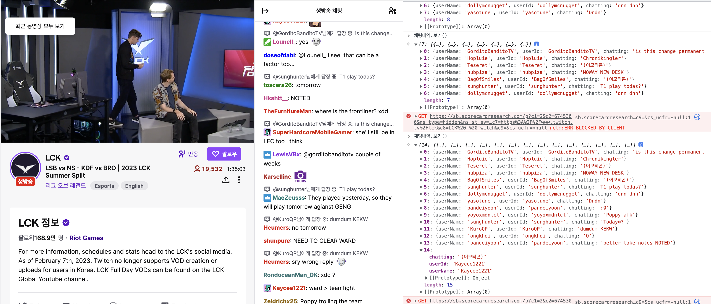

# Twitch-Chatting-Observer

## 이게 먼가요?
트위치 다시보기가 없어지면서 악질 채팅을 완벽하게 잡아낼 수 없을 때가 있습니다.
이럴 때를 대비해서 사용자의 닉네임, id, 해당 채팅 내역을 저장하는 배열을 생성합니다.

## 어떻게 사용하나요?
트위치 채팅창에서 브라우저의 개발자모드를 킨 상태로 console 창에서 index.js 코드 전체를 붙여넣기 합니다.

이후, 채팅 내역을 보고싶다면 console 창에 "채팅내역.보기()"을 입력하면 배열이 나타납니다.
해당 배열은 채팅 생성 순차적으로 되어있으므로 배열의 마지막이 최신 채팅입니다.

채팅이 너무 많아졌다면 "채팅내역.초기화()"를 입력하면 배열이 초기화됩니다.

## 사용 예시

